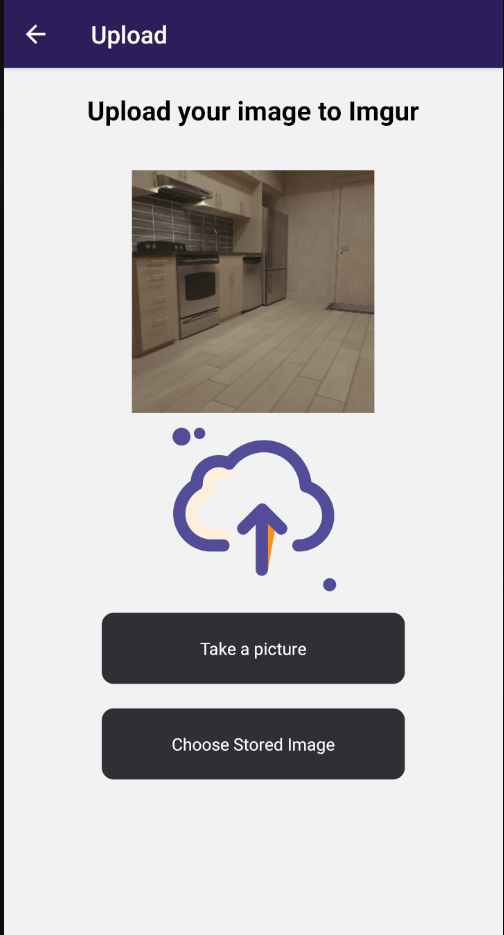
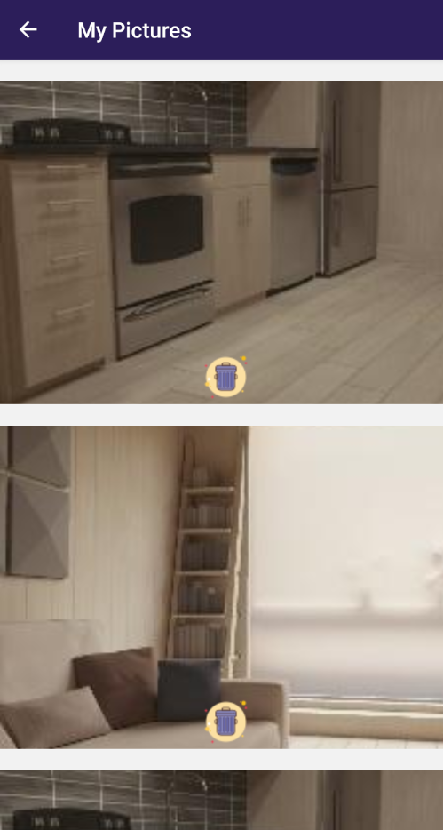

This is a [React Native](https://reactnative.dev/) project.

## Introduction 

This React Native app is using Imgur API (https://apidocs.imgur.com/).
The Oauth2 authentication has been done with react-native-app-auth (https://github.com/FormidableLabs/react-native-app-auth) library. 
Once register on Imgur and logged in the user can search for pictures on imgur plateform using name, tags, add pictures to his favorite, take picture with camera and upload those pictures to his Imgur profile, show the uploaded pictures and delete them.


### Home page 


### Search


### Upload 


### MyPictures 



## Getting Started

First install dependencies and run the Android emulator (you need to have a working Android Studio installation):

```bash
npm install

react-native run-android
```

